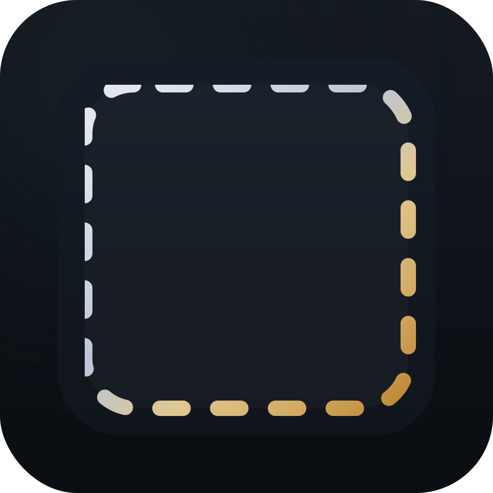

<p align="center">
  
</p>

<h1 align="center">ScapLog</h1>

<p align="center">
  <strong>macOS Screen Capture & AI Summarization</strong>
</p>

<p align="center">
  <a href="#日本語">日本語</a> | <a href="#english">English</a>
</p>

---

## 日本語

### 概要

ScapLogは、macOS向けのスクリーンキャプチャ＆AI要約アプリケーションです。定期的にスクリーンショットを撮影し、AIまたはOCRを使用して画面内容を自動的に要約・記録します。

### 主な機能

- **自動スクリーンキャプチャ**: 設定した間隔で自動的にスクリーンショットを撮影
- **AI要約**: 外部AIコマンド（Gemini、Claude等）を使用した画面内容の要約
- **内蔵OCR**: macOS内蔵のOCR機能による高速テキスト抽出
- **グローバルホットキー**: カスタマイズ可能なショートカットで即座にキャプチャ
- **プライバシーフィルター**:
  - 特定アプリの除外
  - プライベートブラウジング検出
  - ブラウザプロファイル別の除外
  - キーワードベースのフィルタリング
- **視覚フィードバック**: キャプチャ時のエフェクト（ボーダーグロー、フラッシュ、ビネット、シュリンク）
- **サウンドフィードバック**: カスタマイズ可能なキャプチャ音（音量調整可能）
- **履歴管理**: 過去のキャプチャを検索・閲覧・エクスポート
- **統計表示**: キャプチャ数や使用状況の可視化
- **カラーテーマ**: 複数のテーマから選択可能
- **ログイン時起動**: 自動起動オプション

### 必要な権限

- **画面収録**: スクリーンキャプチャに必要
- **アクセシビリティ**: アクティブウィンドウ情報の取得に必要

### インストール

1. リポジトリをクローン:
   ```bash
   git clone https://github.com/yasunogithub/ScapLog.git
   ```

2. Xcodeでプロジェクトを開く:
   ```bash
   cd ScapLog
   open ScapLog.xcodeproj
   ```

3. ビルドして実行（Cmd + R）

### 使い方

1. 初回起動時に画面収録の権限を許可
2. メニューバーのアイコンから操作
3. 設定でAIコマンドまたはOCRを選択
4. 「開始」ボタンまたはホットキーでキャプチャ開始

### システム要件

- macOS 14.0 (Sonoma) 以上
- Xcode 15.0 以上（ビルド時）

### ライセンス

MIT License - 詳細は [LICENSE](LICENSE) を参照

---

## English

### Overview

ScapLog is a screen capture & AI summarization application for macOS. It automatically takes screenshots at regular intervals and summarizes screen content using AI or OCR.

### Key Features

- **Automatic Screen Capture**: Takes screenshots at configurable intervals
- **AI Summarization**: Summarizes screen content using external AI commands (Gemini, Claude, etc.)
- **Built-in OCR**: Fast text extraction using macOS native OCR
- **Global Hotkey**: Customizable keyboard shortcut for instant capture
- **Privacy Filters**:
  - Exclude specific apps
  - Private browsing detection
  - Browser profile-based exclusion
  - Keyword-based filtering
- **Visual Feedback**: Capture effects (border glow, flash, vignette, shrink)
- **Sound Feedback**: Customizable capture sounds with volume control
- **History Management**: Search, browse, and export past captures
- **Statistics**: Visualization of capture count and usage
- **Color Themes**: Multiple themes to choose from
- **Launch at Login**: Auto-start option

### Required Permissions

- **Screen Recording**: Required for screen capture
- **Accessibility**: Required for active window information

### Installation

1. Clone the repository:
   ```bash
   git clone https://github.com/yasunogithub/ScapLog.git
   ```

2. Open the project in Xcode:
   ```bash
   cd ScapLog
   open ScapLog.xcodeproj
   ```

3. Build and run (Cmd + R)

### Usage

1. Grant screen recording permission on first launch
2. Control from the menu bar icon
3. Select AI command or OCR in settings
4. Start capture with the "Start" button or hotkey

### System Requirements

- macOS 14.0 (Sonoma) or later
- Xcode 15.0 or later (for building)

### License

MIT License - See [LICENSE](LICENSE) for details

---

## Screenshots

*Coming soon*

## Contributing

Contributions are welcome! Please feel free to submit a Pull Request.

## Author

Created by Yasuaki Sakamoto ([@yasunogithub](https://github.com/yasunogithub))
